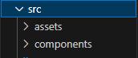
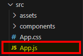
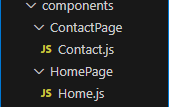
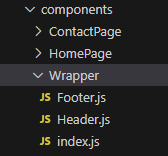
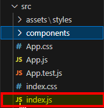
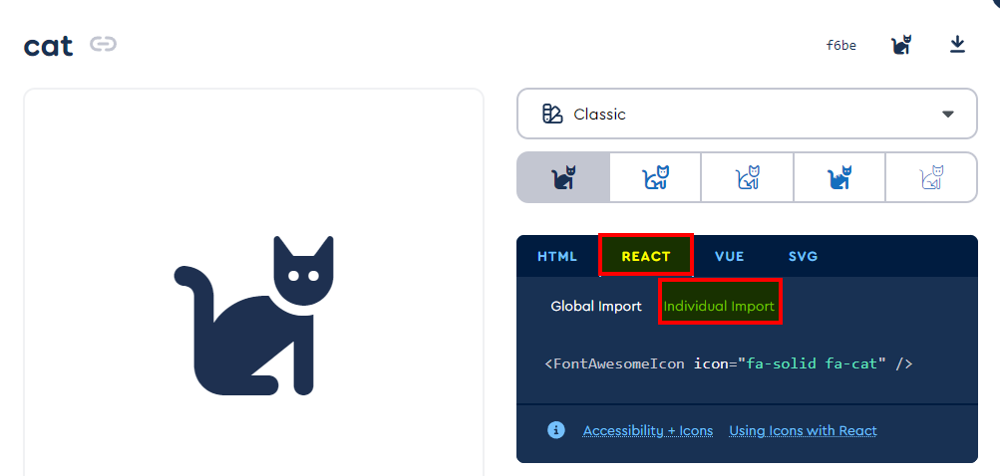

# Routes , images et fontAwesome

Extension Chrome pour React :
- React Developer Tools : https://chromewebstore.google.com/detail/react-developer-tools/fmkadmapgofadopljbjfkapdkoienihi?hl=fr

## Creation d'un nouveau projet 

```shell
npx create-react-app my-first-app
npm install react-router-dom
```

Le react-router-dom est un package qui va te permettre de gérer tes routes entre tes pages.

Dans le dossier `src`, crée les dossiers suivants :




Ensuite dans App.js ecris:



```js
function App() {
	return (
		<div className="App">

		</div>
	);
}

export default App;

```

Pour ajouter une image tu procede comme ceci:

```js
import bunny from "./assets/images/bunny.webp";

function App() {
	return (
		<div className="App">
			
		</div>
	);
}

export default App;
```

### Creation d'un rooter

On wrap `App` dans `Router`.

src\index.js
```js
import React from 'react';
import ReactDOM from 'react-dom/client';
import './index.css';
import App from './App';
import reportWebVitals from './reportWebVitals';

// Importation du  composant BrowserRouter depuis 'react-router-dom'. Ce composant est utilisé pour définir le comportement de la navigation dans votre application.
import { BrowserRouter as Router } from 'react-router-dom';

const root = ReactDOM.createRoot(document.getElementById('root'));
root.render(
	<React.StrictMode>
		<Router>
			<App />
		</Router>
	</React.StrictMode>
);
//En gros le "Router" enveloppe le composant App dans le composant Router pour activer la navigation basée sur les URL.


reportWebVitals();
```

Ensuite, ouvre `App.js`, vide son contenu, puis tape `rsc` pour importer `react-router-dom`. Le fichier devrait ressembler à ceci :


```js
import { Routes, Route } from "react-router-dom";

function App() {
	return (
		<div className="App">
			
		</div>
	);
}

export default App;
```

Tu dois ensuite rajouter le chemin de ta page comme ceci :


```js
import { Routes, Route } from "react-router-dom";

function App() {
	return (
		<main className="App">
			<Routes>
				<Route path="/" element={<Home/>} />
			</Routes>
		</main>
	);
}

export default App;
```

On va ensuite créer des composants qu'on va inclure dans l'application. Dans le dossier `components`, crée les dossiers `Home` et `Contact` comme ceci :




Ensuite, dans chaque dossier, crée un fichier `Home.js` et `Contact.js`. Dans `Home.js`, tape `rsc` pour générer le code initial.

```js
import React from 'react';

const Home = () => {
    return (
        <div>
            
        </div>
    );
};

export default Home;
```

Fais de même dans `Contact.js`. Ensuite, dans `App.js`, tu vas rajouter ta page `Contact.js`, ce qui donne ceci :

```js
import './App.css';
import { Route, Routes } from "react-router-dom";
import Contact from './components/ContactPage/Contact';
import Home from './components/HomePage/Home';

function App() {
  return (
    <main className='App'>
      <Routes>
        <Route path="/" element={<Home />} />
        <Route path="/contact" element={<Contact />} />
      </Routes>

    </main>
// Dans path tu note l'url que tu souhaite et dans element tu inclu ton composant 
  );
}

export default App;
```

Maintenant, on va inclure un Wrapper. Les wrappers sont des composants qui sont appelés sur toutes tes pages, comme une navbar et un footer. C'est d'ailleurs ce qu'on va faire.

Dans `components`, tu vas créer un dossier `Wrapper` et ajouter à l'intérieur des fichiers `index.js`, `Footer.js` et `Header.js`. Ça donne ceci :




Ensuite, dans `Header.js` et `Footer.js`, tape `rsc` pour générer le code initial. À noter que `rsc` va t'importer la bibliothèque React automatiquement, comme ceci :

 ```js 
import React from 'react';
```
Mais tu peux la supprimer car React l'importe automatiquement, ce qui donne ceci :

```js
const Header = () => {
    return (
        <div>
            
        </div>
    );
};

export default Header;
```

Dans le composant `index.js` du Wrapper, importe `Header` et `Footer`, et utilise le destructuring pour afficher `children`, comme ceci :

```js
import Header from "./Header";
import Footer from "./Footer";

const index = ({children}) => {
    return (
        <>
            <Header/>            
            {children}
            <Footer/>
        </>
    );
};

export default index;
```
#### Navigation

Pour ajouter des liens, on n'utilisera pas la balise `<a href="">`, mais la balise `<Link>`, qui est un composant de `react-router-dom`. On va donc faire une navigation dans le header comme ceci :

```js
import { Link } from "react-router-dom";

const Header = () => {
    return (
        <nav>
            <ul>
                <li><Link to={"/"}>Home</Link></li>
                <li><Link to={"/contact"}>Contact</Link></li>
            </ul>
        </nav>
    );
};

export default Header;
```

Tu peux ajouter du style à ta navigation en créant un dossier `styles` et en y ajoutant un fichier `Header.css`. Ensuite, tu l'importes, ce qui donne ceci :

```js
import { Link } from "react-router-dom";
import '../../assets/styles/header.css';

const Header = () => {
    return (
        <nav>
            <ul className="d-flex">
                <li className="nav-item"><Link to={"/"}>Home</Link></li>
                <li className="nav-item"><Link to={"/contact"}>Contact</Link></li>
            </ul>
        </nav>
    );
};

export default Header;
```

Dans `Header.css`, tu peux rajouter ceci :

```css
.d-flex {
    display: flex;
}

.nav-item {
    list-style: none;
    font-size: 1.25rem;
    margin-right: 1.25rem;
}

.nav-item a {
    color: rgb(0, 115, 255);
    text-decoration: none;
}
```

Ça ne sert à rien, car on va rajouter Bootstrap XDDDDDD

Dans le terminal, tu peux coller ceci :

```shell
npm i bootstrap@5.3.3
```

Et dans `index.js` de l'application (pas de ton wrapper), par exemple ici :



Tu rajoutes les 2 imports suivants :

```js
import 'bootstrap/dist/css/bootstrap.min.css'
import 'bootstrap/dist/js/bootstrap'
```

Ton composant doit donc ressembler à ceci :

```js
import React from 'react';
import ReactDOM from 'react-dom/client';
import './index.css';
import App from './App';
import reportWebVitals from './reportWebVitals';
import { BrowserRouter as Router } from 'react-router-dom';
import 'bootstrap/dist/css/bootstrap/bootstrap.min.css'
import 'bootstrap/dist/js/bootstrap.min.js'

const root = ReactDOM.createRoot(document.getElementById('root'));
root.render(
	<React.StrictMode>
		<Router>
			<App />
		</Router>
	</React.StrictMode>
);

// If you want to start measuring performance in your app, pass a function
// to log results (for example: reportWebVitals(console.log))
// or send to an analytics endpoint. Learn more: https://bit.ly/CRA-vitals
reportWebVitals();
```

Et voilà, tu as Bootstrap ! :DDD
Maintenant, tu peux t'amuser à aller chercher un footer et une navbar de Bootstrap et les ajouter dans tes composants `Header` et `Footer`.
/!\ N'oublie pas que tu devras remplacer les balises `<a href="">` par des balises `<Link>` de React, ce qui donne ceci :


```js
const Header = () => {
    return (
        <nav className="navbar navbar-expand-lg bg-body-tertiary">
            <div className="container-fluid">
                <a className="navbar-brand" href="#">Navbar</a>
                <button className="navbar-toggler" type="button" data-bs-toggle="collapse" data-bs-target="#navbarNavAltMarkup" aria-controls="navbarNavAltMarkup" aria-expanded="false" aria-label="Toggle navigation">
                    <span className="navbar-toggler-icon"></span>
                </button>
                <div className="collapse navbar-collapse" id="navbarNavAltMarkup">
                    <div className="navbar-nav">
                        <Link className="nav-link" to={"/"}>
                            Accueil
                        </Link>
                        <Link className="nav-link" to={"/contact"}>
                            Contact
                        </Link>
                    </div>
                </div>
            </div>
        </nav>
    );
};

export default Header;
```

##### Import de fontAwesome

Imaginons que tu veuilles ajouter une icône de petit chat, parce que miaou. Bon, beh tu fais pas chier et tu vas voir la doc... Nan, c'est une vanne, je vais t'expliquer.

Tu vas devoir installer ces packages :


```shell
npm i --save @fortawesome/fontawesome-svg-core

npm i --save @fortawesome/free-solid-svg-icons
npm i --save @fortawesome/free-regular-svg-icons
npm i --save @fortawesome/free-brands-svg-icons

npm i --save @fortawesome/react-fontawesome@latest
```

Ou en une ligne de commande 

```shell
npm install --save @fortawesome/fontawesome-svg-core @fortawesome/free-solid-svg-icons @fortawesome/free-regular-svg-icons @fortawesome/free-brands-svg-icons @fortawesome/react-fontawesome@latest
```

Maintenant, si tu veux rajouter ton petit chat, tu vas devoir importer la bibliothèque dans le composant où tu souhaites rajouter ton icône, comme ceci :

```js
import React from "react";
import { Link } from "react-router-dom";
import '../../assets/styles/Header.css';
//Tu importe la bibliotheque ici
import { FontAwesomeIcon } from '@fortawesome/react-fontawesome';


const Header = () => {
    return (
        <nav className="navbar navbar-expand-lg bg-body-tertiary">
            <div className="container-fluid">
                <a className="navbar-brand" href="#">Navbar</a>
                <button className="navbar-toggler" type="button" data-bs-toggle="collapse" data-bs-target="#navbarNavAltMarkup" aria-controls="navbarNavAltMarkup" aria-expanded="false" aria-label="Toggle navigation">
                    <span className="navbar-toggler-icon"></span>
                </button>
                <div className="collapse navbar-collapse" id="navbarNavAltMarkup">
                    <div className="navbar-nav">
                        <Link className="nav-link" to={"/"}>
                            Accueil
                        </Link>
                        <Link className="nav-link" to={"/contact"}>
                            Contact
                        </Link>
                    </div>
                </div>
            </div>
        </nav>
    );
};

export default Header;
```

Pour récupérer ton icône de chat sur Font Awesome, tu cliques sur l'icône que tu désires, puis tu appuies sur l'onglet `React`, et juste en dessous, sur l'onglet `Individual import` :



Pour ensuite l'inclure dans ta page tu fait comme ceci:

```js
import React from "react";
import { Link } from "react-router-dom";
import '../../assets/styles/Header.css';
import { FontAwesomeIcon } from '@fortawesome/react-fontawesome';
//Tu l'importe d'abord ici comme ceci 
import { faCat } from "@fortawesome/free-solid-svg-icons";


const Header = () => {
    return (
        <nav className="navbar navbar-expand-lg bg-body-tertiary">
            <div className="container-fluid">
                <a className="navbar-brand" href="#">Navbar</a>
                <button className="navbar-toggler" type="button" data-bs-toggle="collapse" data-bs-target="#navbarNavAltMarkup" aria-controls="navbarNavAltMarkup" aria-expanded="false" aria-label="Toggle navigation">
                    <span className="navbar-toggler-icon"></span>
                </button>
                <div className="collapse navbar-collapse" id="navbarNavAltMarkup">
                    <div className="navbar-nav">
                        <Link className="nav-link" to={"/"}>

                            <FontAwesomeIcon icon={faCat} />

                        </Link>
                        <Link className="nav-link" to={"/contact"}>
                            Contact
                        </Link>
                    </div>
                </div>
            </div>
        </nav>
        // Puis tu l'appel ici avec la balise <FontAwesome et le nom de ton icon >
    );
};

export default Header;
```

Et Voila c'est fini :D